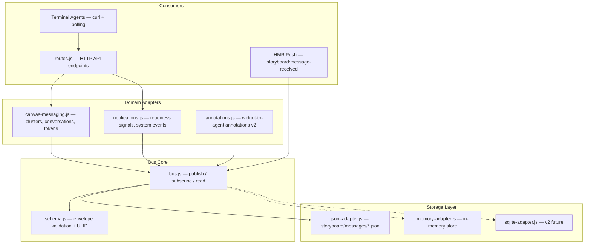
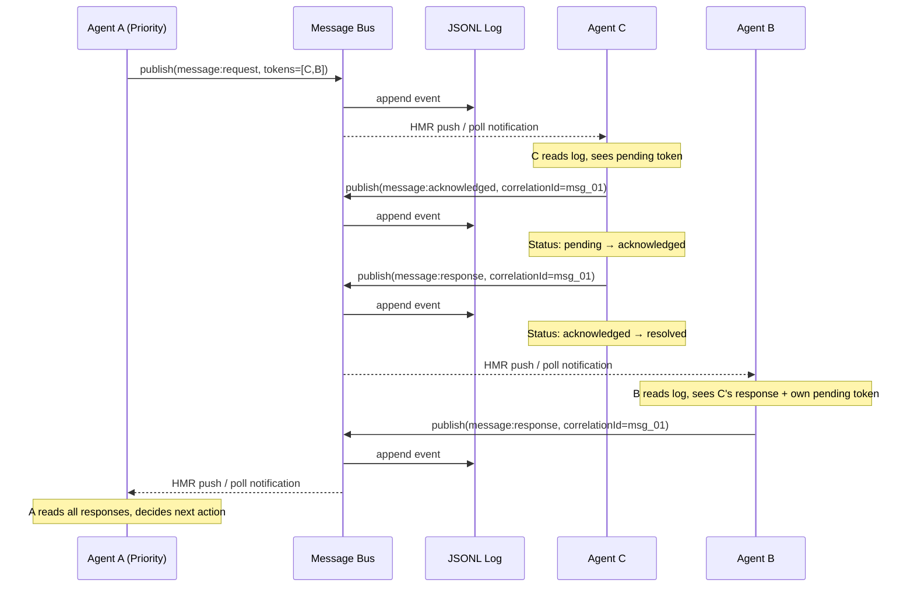
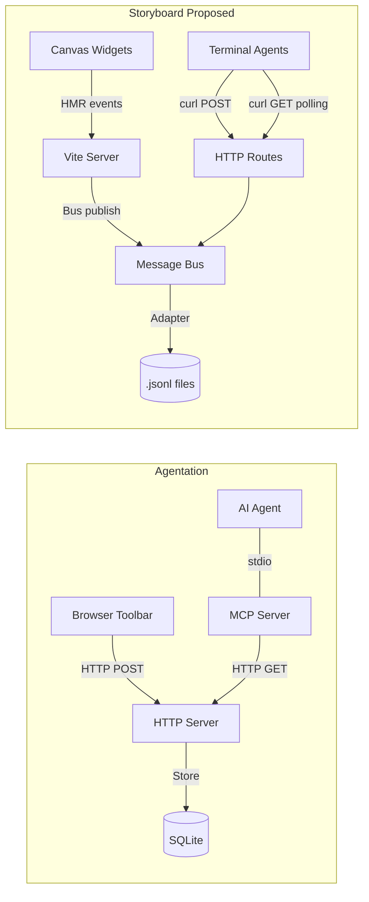

# Research Report: Iterating the Multi-Agent Messaging Bus Plan

## Executive Summary

The existing messaging bus plan (`.agents/plans/0.5.0/0.5.0--multi-agent-messaging-bus.md`) is architecturally sound for the canvas terminal-agent use case but needs three structural changes: **(1) adopt HTTP-like request/response semantics** with correlation IDs, status codes, and explicit request/response pairing (inspired by JSON-RPC 2.0 / MCP's transport pattern, as used by Agentation); **(2) extract the core bus as a reusable internal service** with a minimal storage layer and domain adapter pattern; and **(3) keep the implementation lightweight** — JSONL-only storage (no SQLite/in-memory adapters for v1), chained batch operations to minimize round-trips, and [TOON](https://github.com/toon-format/toon) (Token-Oriented Object Notation) as the agent wire format to cut token consumption by ~40% vs JSON. The server stores JSON internally but encodes/decodes TOON at the HTTP boundary — agents never pay for JSON verbosity.

---

## Table of Contents

1. [Gap Analysis: Current Plan vs. Requirements](#1-gap-analysis)
2. [Agentation Reference Architecture](#2-agentation-reference)
3. [HTTP-Like Request/Response Semantics](#3-http-semantics)
4. [Reusable Service Bus Architecture](#4-service-bus)
5. [Revised Data Design](#5-data-design)
6. [Revised File Structure](#6-file-structure)
7. [Domain Adapters](#7-domain-adapters)
8. [Architecture Diagrams](#8-architecture)
9. [Lightweight Wire Format & Operation Chaining](#9-lightweight)
10. [Implementation Impact on Existing Plan](#10-plan-delta)
11. [Confidence Assessment](#11-confidence)

---

## 1. Gap Analysis: Current Plan vs. Requirements {#1-gap-analysis}

### What the current plan does well

- **JSONL append-only log** — proven pattern matching the canvas materializer[^3]
- **Cluster lifecycle** — well-designed formation/dissolution/split via connected components[^6]
- **Token-based turn order** — message tokens + cluster token solve multi-party conversation sequencing[^7]
- **Passive members + readiness signals** — `system:widget:ready` event handles non-agent widgets[^8]
- **Undo behavior** — append-only log with `system:widget:rejoined` handles Cmd+Z cleanly[^9]

### What's missing

| Gap | Why it matters | Reference model |
|-----|---------------|-----------------|
| **No correlation IDs** | Messages don't explicitly pair request→response. The `inReplyTo` field exists but isn't enforced as a correlation mechanism with pending-map semantics | MCP's `id` field + `_responseHandlers` Map[^2] |
| **No status codes on messages** | The plan has lifecycle states on conversations (`active/finalized`) but no per-message status (pending→acknowledged→resolved) | Agentation's annotation lifecycle[^10] |
| **No explicit request/response pairing** | `message:send` and `message:response` are separate event types but don't form a typed pair with guaranteed correlation | JSON-RPC request/response pairs[^11] |
| **Tightly coupled to canvas/terminals** | The plan hardcodes JSONL paths per canvas, terminal config fields, and cluster-specific event types at every layer | Need storage abstraction + domain adapters |
| **No storage abstraction** | JSONL is hardcoded — needs a thin adapter interface for testability, but SQLite/in-memory adapters are deferred to v2 | Agentation's store abstraction[^12] |
| **No generalized notification system** | `system:widget:ready` is cluster-scoped; no way for non-cluster consumers to subscribe to widget updates | Agentation's event bus pattern[^13] |
| **No annotation passing** | The plan doesn't cover widget↔agent annotation exchange outside terminal messaging | Agentation's full annotation schema (AFS v1.1)[^14] |
| **No progress/streaming** | No equivalent of MCP's `notifications/progress` for long-running agent tasks | MCP progress notifications[^15] |

---

## 2. Agentation Reference Architecture {#2-agentation-reference}

Agentation runs **two servers sharing one data store** — an HTTP server for the browser toolbar and an MCP stdio server for AI agents[^1]. The MCP server doesn't touch the store directly; it calls the HTTP API as its single source of truth[^16].

### Data Flow

```
Browser Toolbar → HTTP POST /annotations → HTTP Server → Store (SQLite/memory)
AI Agent (Claude) ←→ MCP stdio ←→ MCP Server → HTTP GET/PATCH → Store
```

### Key Design Patterns We Should Adopt

**1. Annotation lifecycle as HTTP-like states**[^10]:
```
pending → acknowledged → resolved / dismissed
   ↓           ↓             ↓
HTTP sent   102 Processing   200 OK / 410 Gone
```

**2. Threaded replies on annotations**[^17]:
```typescript
type ThreadMessage = {
  id: string;
  role: "human" | "agent";
  content: string;
  timestamp: number;
};
```

**3. Event envelope with sequence numbers for replay**[^18]:
```typescript
type AgentationEvent = {
  type: "annotation.created" | "annotation.updated" | "annotation.deleted"
      | "session.created" | "session.updated" | "session.closed"
      | "thread.message" | "action.requested";
  timestamp: string;
  sessionId: string;
  sequence: number;  // enables gap detection and replay
  payload: Annotation | Session | ThreadMessage | ActionRequest;
};
```

**4. Long-polling watch with batch window**[^19]:
- `agentation_watch_annotations` blocks until new annotations arrive
- After first annotation, collects for a batch window (default 10s) before returning
- This replaces busy-polling with efficient blocking

**5. Store abstraction**[^12]:
```typescript
// SQLite or memory backends, swappable at runtime
function getStore(): AFSStore {
  if (process.env.AGENTATION_STORE === "memory") return createMemoryStore();
  return createSQLiteStore();  // fallback to memory if sqlite unavailable
}
```

### Design Goals from AFS v1.1 Schema[^20]

1. **Agent-readable** — Structured data LLMs can parse without guessing
2. **Framework-agnostic** — Works with any UI
3. **Tool-agnostic** — Any tool can emit, any agent can consume
4. **Human-authored** — Designed for feedback from humans (or automated reviewers)
5. **Minimal core** — Few required fields, many optional for richer context

These goals directly apply to the messaging bus: the bus should be agent-readable (structured JSON), framework-agnostic (not React-specific), tool-agnostic (any tool/agent can publish/subscribe), and have a minimal core envelope.

---

## 3. HTTP-Like Request/Response Semantics {#3-http-semantics}

Three production systems converge on the same pattern for request/response in messaging[^21]:

### The Correlation ID Pattern

Every system uses a **unique ID embedded in each message** to pair requests with responses:

| System | Correlation mechanism | Scope |
|--------|----------------------|-------|
| JSON-RPC 2.0 | `id` field (integer/string)[^11] | Per-session counter |
| MCP | `id` field (integer) + `_responseHandlers` Map[^2] | Per-session counter |
| NATS | `Reply` inbox subject (`_INBOX.<nuid>.<token>`)[^22] | Per-connection unique inbox |

### The Pending-Map Pattern (from MCP SDK)

```typescript
// How MCP pairs requests to responses internally
class Protocol {
  private _requestMessageId = 0;
  private _responseHandlers: Map<number, (response) => void> = new Map();

  async request(method, params) {
    return new Promise((resolve, reject) => {
      const id = this._requestMessageId++;  // correlation ID
      this._responseHandlers.set(id, handler);  // register pending
      this._transport.send({ jsonrpc: "2.0", method, params, id });
      // timeout after 60s
    });
  }

  private _onresponse(response) {
    const handler = this._responseHandlers.get(response.id);  // look up
    this._responseHandlers.delete(response.id);  // remove from pending
    handler(response);  // fulfill promise
  }
}
```
[^2]

### Mapping to Storyboard's Messaging Bus

The current plan's `message:send` → `message:response` flow should adopt explicit request/response pairing:

```jsonc
// REQUEST (agent A sends a message)
{
  "id": "msg_01HXYZ...",
  "type": "message:request",        // was: message:send
  "correlationId": "msg_01HXYZ...", // self-referencing for the original request
  "status": "pending",              // NEW: HTTP-like status
  "senderId": "widget-a-id",
  "body": "Give me ideas for next week's planning",
  "messageTokens": [
    { "widgetId": "widget-c-id", "order": 0, "status": "pending" },
    { "widgetId": "widget-b-id", "order": 1, "status": "pending" }
  ]
}

// RESPONSE (agent C responds)
{
  "id": "msg_01HXYZ_resp_c",
  "type": "message:response",       // explicit response type
  "correlationId": "msg_01HXYZ...", // links back to the request
  "status": "resolved",             // NEW: HTTP 200 equivalent
  "senderId": "widget-c-id",
  "body": "Here are some ideas: ..."
}

// ACKNOWLEDGMENT (intermediate, like HTTP 102)
{
  "id": "msg_01HXYZ_ack_b",
  "type": "message:acknowledged",    // NEW: 102 Processing equivalent
  "correlationId": "msg_01HXYZ...",
  "senderId": "widget-b-id"
}
```

### Status Codes for Messages

Drawing from Agentation's lifecycle and NATS's HTTP-like status codes[^23]:

| Status | HTTP Equivalent | Meaning |
|--------|----------------|---------|
| `pending` | Request sent | Message created, awaiting response |
| `acknowledged` | 102 Processing | Recipient has seen the message |
| `resolved` | 200 OK | Message successfully addressed |
| `dismissed` | 410 Gone | Message dismissed with reason |
| `failed` | 500 Error | Recipient failed to process |
| `timed_out` | 408 Timeout | No response within deadline |
| `cancelled` | Client abort | Sender cancelled the request |

### Notifications (One-Way, No Response Expected)

Following JSON-RPC 2.0's convention — a message with no `correlationId` or with `type: "notification:*"` is fire-and-forget[^24]:

```jsonc
{
  "id": "ntf_01HABC...",
  "type": "notification:widget:ready",
  "senderId": "agent-a-id",
  "targetWidgetId": "prototype-xyz",
  "body": "Prototype updated with new auth flow"
  // No correlationId — no response expected
}
```

---

## 4. Reusable Service Bus Architecture {#4-service-bus}

### The Core Distinction

The existing plan is **application-specific messaging**: it hardcodes clusters, conversations, and terminal-widget semantics at every layer. A **service bus** inverts this — the bus knows nothing about clusters; clusters are a *consumer* that plugs into the bus[^25].

```
Application-specific (current plan):
  canvas messaging → JSONL file → terminal-config update

Service bus (proposed):
  bus core (publish + subscribe + read)
    ↳ domain adapter: canvas-messaging (clusters, conversations, tokens)
    ↳ domain adapter: annotations     (widget↔agent annotation passing)
    ↳ domain adapter: notifications   (readiness signals, system events)
    ↳ domain adapter: inter-worktree  (future: cross-branch messaging)
```

### Storage Abstraction

```js
/**
 * @typedef {Object} MessageStorageAdapter
 * @property {(channel: string, event: object) => Promise<void>} append
 * @property {(channel: string, opts?: { since?: string, limit?: number }) => Promise<object[]>} read
 * @property {(channel: string, handler: (event: object) => void) => () => void} subscribe
 * @property {() => Promise<void>} [init]
 * @property {() => Promise<void>} [close]
 */
```
[^25]

Three concrete adapters:

| Adapter | When to use | Notes |
|---------|------------|-------|
| **JSONL** (default) | Production — terminal agents can `cat` the file | Matches existing materializer pattern[^3] |
| **In-Memory** | Unit tests — no file I/O | Map<channel, event[]> + synchronous handlers |
| **SQLite** (future v2) | Scale — indexed queries, compaction | `better-sqlite3` with WAL mode |

### Core Bus API

```js
// packages/storyboard/src/core/messaging/bus.js

export function initBus(adapter) { ... }
export function registerEventNamespace(namespace, opts = {}) { ... }
export async function publish(channel, event) { ... }
export function subscribe(channel, handler) { ... }  // returns unsubscribe fn
export async function read(channel, opts = {}) { ... }
```
[^25]

The bus is a singleton within the server process. It validates event type prefixes against registered namespaces (dev mode warnings for unregistered types), delegates persistence to the storage adapter, and notifies in-process subscribers synchronously after append.

### Push vs. Pull: Two Consumer Models

| Consumer | Model | Mechanism |
|----------|-------|-----------|
| Terminal agents (CLI) | **Pull** | `GET /messages/:channel?since={lastId}` polling at 2s[^26] |
| Browser widgets (React) | **Push** | HMR `storyboard:message-received` → `import.meta.hot.on()`[^5] |
| Inter-worktree (future) | **Pull + Push** | REST poll + `fs.watchFile` across worktrees[^27] |

---

## 5. Revised Data Design {#5-data-design}

### Message Envelope v2 (with HTTP-like semantics)

```jsonc
{
  // Identity
  "id": "msg_01HXYZ...",            // ULID — sortable, unique, embeds timestamp
  "timestamp": "2026-05-02T18:04:13.510Z",
  "channel": "viewfinder-redesign", // replaces canvasId at envelope level

  // Correlation (the HTTP request/response pairing)
  "correlationId": "msg_01HXYZ...", // links response to request (null for notifications)
  "status": "pending",              // pending | acknowledged | resolved | dismissed | failed | timed_out | cancelled

  // Sender
  "senderId": "widget-a-id",
  "senderName": "Agent A",

  // Message type (namespaced)
  "type": "message:request",        // namespace:action format

  // Content
  "body": "Give me ideas for next week's planning",
  "payload": {},                     // optional structured data

  // Domain-specific fields (set by domain adapters, not the bus core)
  "clusterId": "cluster_abc123",           // canvas-messaging adapter
  "conversationId": "conv_01HABC...",      // canvas-messaging adapter
  "messageTokens": [...],                   // canvas-messaging adapter
  "clusterTokenHolder": "widget-a-id",     // canvas-messaging adapter
  "successor": "widget-c-id",             // canvas-messaging adapter
  "inReplyTo": null,                       // generic threading
  "targetWidgetId": "prototype-xyz"        // notifications adapter
}
```

**Key changes from the existing plan:**
1. `canvasId` → `channel` at the envelope level (generalized)
2. Added `correlationId` for explicit request/response pairing
3. Added `status` for HTTP-like message lifecycle
4. Domain-specific fields (clusterId, conversationId, messageTokens) are still present but understood as adapter-owned extensions, not core envelope fields

### Core Envelope (bus-level) vs. Domain Extensions (adapter-level)

```jsonc
// CORE ENVELOPE — what the bus validates and routes
{
  "id": "...",
  "timestamp": "...",
  "channel": "...",
  "type": "...",            // must match a registered namespace prefix
  "senderId": "...",
  "senderName": "...",
  "body": "...",            // optional
  "payload": {},            // optional
  "correlationId": "...",   // optional (null = notification/fire-and-forget)
  "status": "...",          // optional (null = no lifecycle tracking)
  "inReplyTo": "..."        // optional (for threading, different from correlation)
}

// DOMAIN EXTENSIONS — adapter adds these, bus passes them through
{
  "clusterId": "...",
  "conversationId": "...",
  "messageTokens": [...],
  // etc.
}
```

### Event Type Namespaces

Each domain adapter registers its namespace at startup:

| Namespace | Owner | Events |
|-----------|-------|--------|
| `cluster:*` | canvas-messaging | `cluster:created`, `cluster:dissolved`, `cluster:priority`, `cluster:priority:transfer`, `cluster:token:assign` |
| `conversation:*` | canvas-messaging | `conversation:start`, `conversation:finality`, `conversation:reopen`, `conversation:timeout` |
| `message:*` | canvas-messaging | `message:request`, `message:response`, `message:acknowledged`, `message:token:skipped` |
| `system:*` | canvas-messaging | `system:widget:joined`, `system:widget:left`, `system:widget:deleted`, `system:widget:rejoined` |
| `notification:*` | notifications | `notification:widget:ready`, `notification:widget:updated`, `notification:agent:ready`, `notification:agent:blocked`, `notification:task:complete`, `notification:task:failed` |
| `annotation:*` | annotations (v2) | `annotation:created`, `annotation:updated`, `annotation:resolved`, `annotation:dismissed`, `annotation:thread:message` |

---

## 6. Revised File Structure {#6-file-structure}

The plan references `packages/core/src/canvas/messaging/` but all canvas code actually lives in `packages/storyboard/src/core/canvas/`[^28]. The bus should live one level up from canvas since it's a general service:

```
packages/storyboard/src/core/messaging/
  bus.js                  — core API (initBus, publish, subscribe, read, registerEventNamespace)
  schema.js               — ULID generation, envelope validation, status constants
  toon.js                 — TOON encode/decode boundary (wraps @toon-format/toon)
  storage/
    types.js              — MessageStorageAdapter typedef
    jsonl-adapter.js      — JSONL file backend (only adapter for v1)
  adapters/
    canvas-messaging.js   — cluster/conversation/token domain logic (from existing plan)
    notifications.js      — readiness signals, system events
    annotations.js        — widget-to-agent annotation passing (v2)
  routes.js               — HTTP route handlers with TOON content negotiation
  index.js                — public re-exports
```

### Integration with server-plugin.js

Following the existing route handler registration pattern[^4]:

```js
// In configureServer(), after existing registrations:
import { initBus } from '../messaging/bus.js'
import { JsonlAdapter } from '../messaging/storage/jsonl-adapter.js'
import { setupCanvasMessaging } from '../messaging/adapters/canvas-messaging.js'
import { createMessagingRoutes } from '../messaging/routes.js'

const messagingAdapter = new JsonlAdapter({ root, messagesDir: '.storyboard/messages' })
await messagingAdapter.init()
initBus(messagingAdapter)
setupCanvasMessaging()

routeHandlers.set('messages', createMessagingRoutes({ root, sendJson, bus }))
```

---

## 7. Domain Adapters {#7-domain-adapters}

### 7a. Canvas Messaging Adapter (from existing plan, enhanced)

This adapter encapsulates all cluster/conversation/token logic. The full existing plan logic (cluster lifecycle, token management, priority succession, passive members) moves here unchanged — the only changes are:

1. Uses `publish(channel, event)` instead of direct JSONL append
2. Uses `read(channel, opts)` instead of direct JSONL read
3. Messages use the new envelope with `correlationId` and `status`
4. Event types use `message:request` / `message:response` instead of `message:send` / `message:response`

### 7b. Notifications Adapter

```js
export const NOTIFICATION_TYPES = {
  WIDGET_READY:    'notification:widget:ready',
  WIDGET_UPDATED:  'notification:widget:updated',
  AGENT_READY:     'notification:agent:ready',
  AGENT_BLOCKED:   'notification:agent:blocked',
  TASK_COMPLETE:   'notification:task:complete',
  TASK_FAILED:     'notification:task:failed',
}

export async function notifyWidgetReady({ canvasId, widgetId, agentId, summary }) {
  await publish(canvasId, {
    id: generateId(),
    timestamp: new Date().toISOString(),
    type: NOTIFICATION_TYPES.WIDGET_READY,
    channel: canvasId,
    senderId: agentId,
    targetWidgetId: widgetId,
    body: summary,
  })
}
```
[^25]

The browser subscribes via HMR:
```js
import.meta.hot.on('storyboard:message-received', ({ channel, type }) => {
  if (type.startsWith('notification:')) {
    // Update notification badge, show toast, etc.
  }
})
```

### 7c. Annotations Adapter (v2 — Agentation-inspired)

Per-widget annotation channels enable the Agentation pattern within Storyboard:

```
Channel: "annotations:{widgetId}"
Events: annotation:created, annotation:updated, annotation:resolved, annotation:dismissed
```

An agent connected to a widget reads `.storyboard/terminals/{id}.json` → finds `connectedWidgets` → reads `annotations:{widgetId}` via the bus. The full Agentation workflow (pending→acknowledged→resolved, threaded replies) works through the same bus with different channel naming.

---

## 8. Architecture Diagrams {#8-architecture}

### Overall Bus Architecture



### Request/Response Flow (HTTP Analogy)



### Agentation vs. Storyboard Comparison



---

## 9. Lightweight Wire Format & Operation Chaining {#9-lightweight}

### Problem

Three cost drivers threaten the bus's viability:

1. **Over-engineering** — SQLite and in-memory storage adapters add complexity with no v1 need
2. **Round-trip latency** — Separate publish → poll → read cycles mean 3 HTTP calls per exchange
3. **Token consumption** — Agents reading conversation history pay full JSON verbosity on every call

### Solution A: JSONL-Only Storage (v1)

Drop `memory-adapter.js` and `sqlite-adapter.js`. The `MessageStorageAdapter` interface stays (for future extensibility), but v1 ships with JSONL only. Tests mock at the bus level, not the storage level.

### Solution B: Operation Chaining

Reduce round-trips by combining common operation sequences into single HTTP calls:

| Endpoint | Operations Chained | Replaces |
|----------|-------------------|----------|
| `POST /messages/send` | publish request → block until response or timeout → return response | publish + poll + read (3 calls → 1) |
| `POST /messages/batch` | publish N messages + read from M channels since ULID | publish + read (2+ calls → 1) |
| `GET /messages?channels=a,b,c&since=ULID` | multi-channel read in one shot | N separate channel reads → 1 |

The `send` endpoint is the key optimization: an agent publishes a message and gets the response back in the same HTTP response body — no polling loop needed. The server holds the connection open (with a configurable timeout, default 30s) and resolves when a correlated response arrives on the bus.

```js
// Agent sends a message and gets the response in one call:
// POST /messages/send
// { channel: "canvas-abc", type: "message:request", body: "..." }
//
// Server: publish → subscribe for correlationId → wait → return response
// Response: { status: 200, response: { ...correlated message } }
```

### Solution C: TOON Wire Format

[TOON](https://github.com/toon-format/toon) (Token-Oriented Object Notation) is a compact encoding of the JSON data model designed for LLM consumption. It achieves **~40% fewer tokens** than JSON with equal or better retrieval accuracy across tested models[^31].

**How it fits:**

- The bus stores JSON internally (JSONL files — easy to debug, `cat`-friendly)
- HTTP routes support content negotiation via `Accept` / `Content-Type` headers
- When an agent sends `Accept: text/toon`, the server encodes the JSON response as TOON before sending
- When an agent sends `Content-Type: text/toon`, the server decodes TOON → JSON before processing
- Browser consumers (HMR push) continue to receive JSON — no change

**Implementation:**

```js
// messaging/toon.js — thin boundary wrapper
import { encode, decode } from '@toon-format/toon'

export function negotiateFormat(req) {
  const accept = req.headers?.accept || ''
  return accept.includes('text/toon') ? 'toon' : 'json'
}

export function serializeResponse(data, format) {
  return format === 'toon' ? encode(data) : JSON.stringify(data)
}

export function parseRequestBody(body, contentType) {
  return contentType?.includes('text/toon') ? decode(body) : JSON.parse(body)
}
```

**Token savings example** — agent reads 20 messages with widget state:

```
# JSON (~2,400 tokens):
[{"id":"msg_01","type":"message:request","senderId":"terminal-abc","status":"pending","body":"Review this widget"},...]

# TOON (~1,440 tokens, 40% less):
messages[20]{id,type,senderId,status,body}:
  msg_01,message:request,terminal-abc,pending,Review this widget
  msg_02,message:acknowledged,terminal-def,acknowledged,""
  ...
```

The savings compound with conversation history — the primary token cost center.

**Dependency note:** `@toon-format/toon` is an npm package (~15KB). It's used only in the server-side messaging routes, not in the browser bundle. Since `packages/storyboard/src/core/` aims for zero npm deps, `toon.js` should live in the routes layer (which already depends on Node.js APIs) rather than in `bus.js`.

[^31]: [github.com/toon-format/toon](https://github.com/toon-format/toon) — TOON benchmarks: 76.4% accuracy vs JSON's 75.0% with 39.9% fewer tokens across 4 LLMs on 209 retrieval questions

---

## 10. Implementation Impact on Existing Plan {#10-plan-delta}

### What stays the same

- **Cluster lifecycle** — formation, dissolution, split, priority succession → all move to `canvas-messaging.js` adapter unchanged
- **Token system** — message tokens + cluster token → unchanged
- **Conversations** — start, finality, reopen, timeout → unchanged
- **Passive members** — readiness signals → enhanced by notifications adapter
- **Config schema** — `canvas.messaging` section → unchanged
- **Agent skill behavior** — unchanged, agents still call REST APIs
- **Undo behavior** — append-only log handles rejoins → unchanged

### What changes

| Current Plan | Revised |
|-------------|---------|
| Direct JSONL append in route handlers | `publish(channel, event)` via bus |
| Direct JSONL read in route handlers | `read(channel, opts)` via bus |
| `message:send` / `message:response` types | `message:request` / `message:response` with `correlationId` + `status` |
| No storage abstraction | `MessageStorageAdapter` interface, JSONL-only for v1 (SQLite/in-memory deferred) |
| 3 separate calls per exchange | Chained `send` endpoint (publish + wait + return in 1 call) |
| JSON everywhere | JSON internal storage, TOON on agent wire via content negotiation |
| Hardcoded event types table | Runtime `registerEventNamespace()` |
| `canvasId` as top-level envelope field | `channel` (generic) with `canvasId` as domain field |
| `packages/core/src/canvas/messaging/` | `packages/storyboard/src/core/messaging/` |
| No notification system | `notifications.js` adapter with push via HMR |
| No annotation passing | `annotations.js` adapter (v2, same bus) |

### New Implementation Phases

| Phase | Description | Scope |
|-------|-------------|-------|
| **Phase 0** (new) | **Core bus + JSONL storage** — `bus.js`, `schema.js`, `jsonl-adapter.js` (no SQLite/in-memory) | Foundation |
| **Phase 1** | Canvas messaging adapter — clusters, tokens, conversations (existing plan Phase 1-2) | Same as before |
| **Phase 2** | Server integration — chained routes (`send`, `batch`, multi-channel `read`), TOON content negotiation, terminal config, config schema | Enhanced |
| **Phase 3** | Notifications adapter — readiness signals, agent status, task lifecycle | New |
| **Phase 4** | Annotations adapter — widget-to-agent annotation passing | New (v2) |
| **Phase 5** | Polish — timeout enforcement, HMR push, cleanup (existing plan Phase 4) | Same as before |

### ULID Dependency

The plan calls for ULID-based message IDs but no ULID library exists in the repo[^28]. Options:
- **Inline 30-line implementation** in `schema.js` (zero dependencies, matches the `packages/core` convention of no npm deps)
- **`ulid` npm package** (tiny, well-maintained)

Recommendation: inline implementation, since `packages/storyboard/src/core/` aims for zero npm dependencies.

---

## 11. Confidence Assessment {#11-confidence}

### High confidence

- **Agentation architecture and schema** — directly verified from their public docs and npm package source[^1][^14][^16]
- **MCP request/response correlation** — verified from the official TypeScript SDK source and specification[^2][^11][^15]
- **Storyboard server implementation** — verified from actual codebase with line numbers[^28][^29][^30]
- **Storage abstraction pattern** — proven by Agentation's store.ts and Storyboard's own materializer[^3][^12]
- **No implementation has started** — confirmed: `packages/storyboard/src/core/messaging/` directory does not exist[^28]

### Medium confidence

- **HTTP status code mapping** — the mapping of annotation lifecycle states to HTTP codes is an editorial inference drawing on NATS's literal use of HTTP status codes in message headers[^23] and Agentation's stated design goals[^20]. No system explicitly documents this mapping.
- **Inter-worktree JSONL sharing** — `appendFileSync` is safe for single-writer; concurrent appends from multiple Vite processes need file locking (not a v1 concern)[^27]
- **File path correction** — the plan says `packages/core/` but all canvas code lives in `packages/storyboard/`[^28]. This is a naming discrepancy that should be corrected in the updated plan.

### Assumptions made

- The bus will be server-side only (Node.js) — browser-side consumers use HMR push or REST polling
- Terminal agents will continue using `curl` for REST API access (no MCP integration needed for Storyboard's own bus)
- The JSONL adapter is sufficient for v1; SQLite and in-memory adapters are deferred
- TOON wire format (`@toon-format/toon`) will be used for agent-facing HTTP responses; browser consumers stay on JSON
- Operation chaining (`send` endpoint with server-side wait) keeps agent round-trips to 1 per exchange
- Annotation passing (v2) will follow Agentation's AFS schema structure adapted for Storyboard's widget model

---

## Footnotes

[^1]: [agentation.com/mcp](https://www.agentation.com/mcp) — "Runs two servers simultaneously, sharing the same data store: HTTP Server for the browser toolbar, MCP Server for agents via stdio"

[^2]: `modelcontextprotocol/typescript-sdk:packages/core/src/shared/protocol.ts` — `_responseHandlers: Map<number, handler>`, `_requestMessageId = 0` auto-incrementing correlation

[^3]: `packages/storyboard/src/core/canvas/materializer.js:1-70` — append-only JSONL replay pattern

[^4]: `packages/storyboard/src/core/vite/server-plugin.js:93-302` — route handler registry (`routeHandlers` Map)

[^5]: `packages/storyboard/src/core/canvas/server.js:493-506` — `server.ws.send({ type: 'custom', event: 'storyboard:canvas-file-changed' })` HMR push pattern

[^6]: `.agents/plans/0.5.0/0.5.0--multi-agent-messaging-bus.md:52-59` — cluster formation via connected components

[^7]: `.agents/plans/0.5.0/0.5.0--multi-agent-messaging-bus.md:62-76` — message tokens + cluster token

[^8]: `.agents/plans/0.5.0/0.5.0--multi-agent-messaging-bus.md:497-531` — passive members + readiness signals

[^9]: `.agents/plans/0.5.0/0.5.0--multi-agent-messaging-bus.md:549-562` — undo behavior

[^10]: [agentation.com/mcp](https://www.agentation.com/mcp) — annotation status lifecycle: pending → acknowledged → resolved/dismissed

[^11]: [jsonrpc.org/specification](https://www.jsonrpc.org/specification) §4 — "The Server MUST reply with the same value in the Response object if included"

[^12]: `benjitaylor/agentation:mcp/src/server/store.ts:1-50` — `AFSStore` interface with SQLite and memory backends

[^13]: `benjitaylor/agentation:mcp/src/server/events.ts:1-80` — `EventBus` singleton for real-time streaming

[^14]: [agentation.com/schema](https://www.agentation.com/schema) — Annotation Format Schema v1.1, full TypeScript definition

[^15]: `modelcontextprotocol/specification:schema/2025-03-26/schema.ts:294-318` — `ProgressNotification` with `progressToken`

[^16]: `benjitaylor/agentation:mcp/src/server/mcp.ts:1-8` — "This server fetches data from the HTTP API (single source of truth)"

[^17]: [agentation.com/schema](https://www.agentation.com/schema) — `ThreadMessage` type: `{ id, role, content, timestamp }`

[^18]: [agentation.com/schema](https://www.agentation.com/schema) — `AgentationEvent` envelope with `sequence` number for gap detection

[^19]: [agentation.com/mcp](https://www.agentation.com/mcp) — `agentation_watch_annotations` with `batchWindowSeconds` (default 10, max 60) and `timeoutSeconds` (default 120, max 300)

[^20]: [agentation.com/schema#design-goals](https://www.agentation.com/schema#design-goals) — five design goals: agent-readable, framework-agnostic, tool-agnostic, human-authored, minimal core

[^21]: Research synthesis from NATS request/reply, JSON-RPC 2.0, and MCP Streamable HTTP transport patterns

[^22]: `nats-io/nats.go:nats.go` — `respMap map[string]chan *Msg` keyed by inbox token, `Msg.Reply` field as correlation

[^23]: `nats-io/nats.go:nats.go` constants — `noResponders="503"`, `reqTimeoutSts="408"`, `controlMsg="100"` — literal HTTP status codes in NATS message headers

[^24]: JSON-RPC 2.0 spec — absence of `id` field = notification, server MUST NOT reply

[^25]: Research subagent: reusable service bus architecture analysis, `packages/storyboard/src/core/messaging/bus.js` proposed design

[^26]: `.agents/plans/0.5.0/0.5.0--multi-agent-messaging-bus.md:399-406` — pull-based polling at 1-2s intervals

[^27]: Research subagent: inter-worktree messaging analysis — `.storyboard/messages/` at repo root is naturally shared; `appendFileSync` safe for single writer

[^28]: Research subagent: Storyboard server investigation — actual path is `packages/storyboard/src/core/canvas/`, not `packages/core/`; no messaging directory exists

[^29]: `packages/storyboard/src/core/canvas/server.js:1096-1231` — `POST /broadcast` implementation

[^30]: `packages/storyboard/src/core/canvas/server.js:2628-2717` — `POST /terminal/send` implementation
