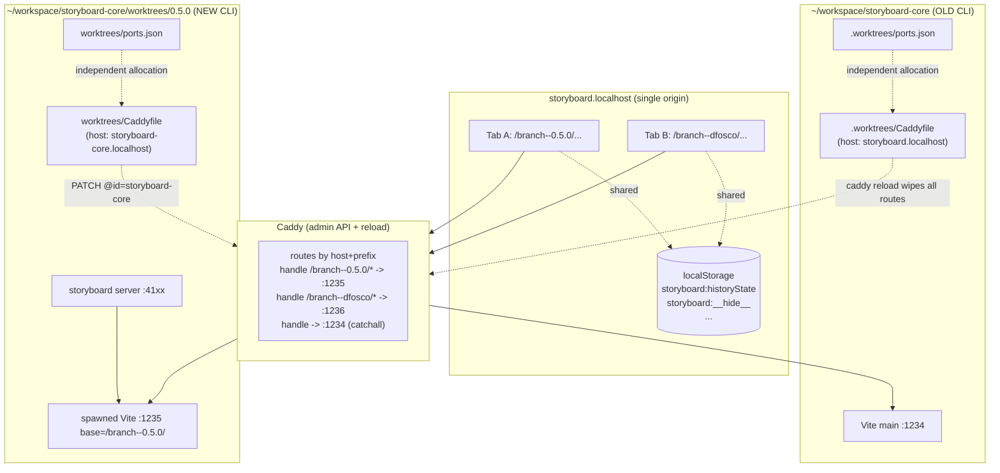
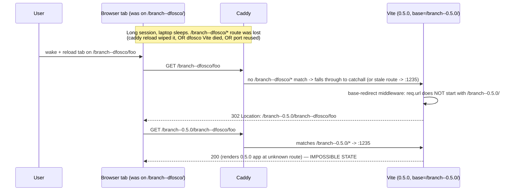

# Why `http://storyboard.localhost/branch--0.5.0/branch--dfosco` happens

> Deep-research + 5 Whys root-cause analysis of the impossible-URL bug, with prioritized fixes.

## Executive summary

The doubled-prefix URL is not one bug but **the deterministic outcome of three reinforcing design choices**:

1. **Two repos share one origin (`storyboard.localhost`)** because the legacy `storyboard-core` checkout has no `devDomain` in `storyboard.config.json` and falls back to the same default domain as `dfosco/storyboard` 0.5.0[^domain-default][^core-config].
2. **Each repo keeps its own port registry and its own Caddyfile**, with no cross-repo coordination[^port-file][^caddy-file]. The OLD CLI calls `caddy reload --config <its file>` which atomically replaces *all* Caddy routes — silently wiping the other repo's routes[^reload-destructive]. The NEW CLI uses the admin-API PATCH path, but falls back to `caddy reload` whenever the admin API errors[^new-fallback], and `storyboard setup` *always* uses the destructive path[^setup-destructive].
3. **Vite's `base-redirect` middleware blindly prepends its own `base` to any unrecognized URL**[^base-redirect]. The instant Caddy mis-routes a request for `/branch--B/...` to the server hosting `/branch--A/`, the server replies `302 Location: /branch--A/branch--B/...` — the exact observed pattern.

Add browser-side amplifiers — `hashPreserver` feeding raw cross-app paths to a basename-aware router[^hash-preserver-bug], and an HMR WebSocket whose path (`/@vite/hmr`) carries no branch prefix and therefore always routes to whichever Vite happens to own the catch-all[^hmr-no-prefix] — and the bug becomes inevitable after a long session + laptop sleep.

The bug **cannot be fixed in one place**. The high-leverage fixes are: (a) stop calling `caddy reload` destructively; (b) make the `base-redirect` middleware refuse to prepend over an existing `branch--` segment; (c) give every checkout a unique `devDomain` so the two repos stop sharing a Caddy host.

---

## Architecture in one diagram



---

## The deterministic failure trace



---

## 5 Whys

**Why does the browser end up at `/branch--0.5.0/branch--dfosco/`?**
Because Vite's `base-redirect` middleware on the 0.5.0 server received a request whose path didn't start with its own `base`, and redirected with `Location = base + req.url`[^base-redirect].

**Why did the 0.5.0 Vite receive a request meant for `dfosco`?**
Because Caddy no longer had a `/branch--dfosco/*` route, so the request fell through to a catch-all (or a stale route pointing at the now-recycled port 1235). The two checkouts share the host `storyboard.localhost`, so their routes live in the same Caddy host block[^domain-default][^caddy-file].

**Why did Caddy lose the `/branch--dfosco/*` route?**
Two mechanisms, either is sufficient. (a) The OLD CLI's `caddy reload --config <its Caddyfile>` atomically replaces the entire running config; it knows nothing about the other checkout and silently overwrites its routes[^reload-destructive][^setup-destructive]. (b) After laptop sleep the dfosco Vite process died and was never re-registered; the route survived in stale form pointing to a port that was later reused by the 0.5.0 server[^prune-pid].

**Why do the two checkouts collide on routes and ports?**
Each checkout maintains an *independent*, repo-local registry: `<repoRoot>/worktrees/ports.json` (NEW) or `<repoRoot>/.worktrees/ports.json` (OLD), each starting at port 1234, with no cross-repo coordination[^port-file]. Caddyfile generation likewise emits a per-repo file scoped to that repo's `devDomain` only[^caddy-file]. The OLD CLI in `~/workspace/storyboard-core` has no `devDomain` set in its `storyboard.config.json` and therefore defaults to `storyboard.localhost` — colliding with the 0.5.0 worktree's expectation[^domain-default][^core-config].

**Why is there no global coordination?**
Because the proxy/registry was designed assuming one storyboard checkout per machine. `devDomain` was added later as the disambiguation hook, but (i) it isn't required, (ii) the default value is the same for everyone, and (iii) `storyboard setup` and the `caddy reload` fallback are still global-config writes that ignore other repos' routes[^setup-destructive][^new-fallback]. The Vite middleware that creates the doubled URL was added to *help* users land on the right base when they typed a bare path — its blind concatenation predates the multi-repo scenario[^base-redirect].

---

## Hypotheses → prioritized solutions

### H1 — `base-redirect` middleware concatenates over an existing `branch--` segment **(critical, high confidence, smallest fix)**

The middleware in `vite.config.js:95-113`[^base-redirect] does:
```js
if (req.url && req.url !== baseNoTrail
    && !req.url.startsWith(base)
    && !req.url.startsWith('/@')
    && !req.url.startsWith('/node_modules/')) {
  const newUrl = baseNoTrail + req.url
  res.writeHead(302, { Location: newUrl }); res.end(); return
}
```
Every observed impossible URL goes through this branch.

**Solutions (priority order):**
1. **Refuse to prepend over a foreign branch prefix.** If `req.url` starts with `/branch--` and that prefix differs from `base`, return a 421 (Misdirected Request) or 404 with a helpful HTML page ("This server is `/branch--0.5.0/`. You asked for `/branch--dfosco/` — that branch is not running on this Vite. Open `<correct URL>` or run `storyboard dev` in that worktree."). One regex guard, ~5 lines. Eliminates the doubled URL entirely.
2. **Skip the redirect for requests whose `Host` doesn't match this server's expected `devDomain`.** Read `process.env.STORYBOARD_DEV_DOMAIN` at boot, compare to `req.headers.host`. Defense in depth against Caddy mis-routing.
3. **Remove the middleware altogether.** It only buys "type a bare path and get redirected to the right base"; that convenience is small and the failure mode is severe.

### H2 — `caddy reload` destructively replaces the entire config **(critical, high confidence)**

`packages/core/src/cli/proxy.js` (OLD) calls `caddy reload --config <repo>/.worktrees/Caddyfile`[^reload-destructive]. `packages/storyboard/src/cli/setup.js:361-373` (NEW) *always* uses `caddy reload` even though the proxy module supports admin-API upsert[^setup-destructive]. The fallback path in NEW `proxy.js:296-301` also `caddy reload`s when the PATCH/POST fails[^new-fallback].

**Solutions (priority order):**
1. **Drop `caddy reload` entirely; only use the admin API.** Initial bootstrap = `POST /load` once with an empty server, then `POST /config/apps/http/servers/srv0/routes` per route. Make `storyboard setup` upsert via admin API too. If admin API is unreachable, fail loudly instead of clobbering.
2. **Make the Caddyfile aggregate across all known repos.** A small daemon (or just a `~/.storyboard/registry.json`) listing every known checkout's routes; regenerate the union before each `caddy reload`. Larger lift, fixes the root cause more thoroughly.
3. **Per-repo Caddy admin "site" namespacing.** Use different listening sockets / unix domain sockets per repo, fronted by a static Caddy that just multiplexes by host. Highest isolation, biggest infra change.

### H3 — Two checkouts share the same `devDomain` **(high, easy fix, addresses the root)**

`storyboard-core` repo root has no `devDomain`[^core-config]. The default is `storyboard.localhost`[^domain-default]. The 0.5.0 worktree's `storyboard.config.json` sets `devDomain: "storyboard-core"` — but only for that worktree. Any time the user runs the OLD CLI from `~/workspace/storyboard-core` it writes routes to `storyboard.localhost`, the same host the user expects "storyboard" to live on.

**Solutions (priority order):**
1. **Require `devDomain` to be set; fail fast if missing.** Have `storyboard dev` and `storyboard setup` refuse to start unless `storyboard.config.json` has `devDomain`. Prompt to write one (default suggestion: repo folder name).
2. **Auto-derive `devDomain` from the absolute repo path hash** when not configured. Stable per-checkout, never collides across machines.
3. **Migrate `storyboard-core` config now**: add `"devDomain": "storyboard-core-legacy"` (or similar) to its top-level `storyboard.config.json`. One-line user-side fix.

### H4 — Independent port registries with no cross-repo awareness **(high, medium fix)**

`<repoRoot>/worktrees/ports.json` (and the OLD `.worktrees/ports.json`) each start at 1234 with no shared lock[^port-file].

**Solutions (priority order):**
1. **Single global registry at `~/.storyboard/ports.json`** keyed by `${devDomain}::${worktreeName}`. Atomic write + advisory lock. Eliminates port reuse-after-restart and cross-repo collisions.
2. **Bind ports to `127.0.0.<n>` instead of `127.0.0.1`** with `n = hash(devDomain) % 250 + 2`. Each repo gets its own loopback IP; ports never collide.
3. **Validate the live process matches the registry on every `storyboard dev`.** If `lsof` says port 1235 is owned by a PID different from `servers.json`, treat the slot as free and reassign. Already partially implemented[^prune-pid]; tighten and apply to *all* registries seen on disk.

### H5 — `hashPreserver` passes raw cross-app paths to a basename-aware router **(medium, browser-side amplifier)**

`hashPreserver.js:17-72`[^hash-preserver-bug] strips `base` from clicked anchors *only when the path starts with that exact base*. A click on `<a href="/branch--dfosco/...">` while in App A produces `router.navigate('/branch--dfosco/...')`, and React Router prepends `basename = /branch--0.5.0/` — yielding the same impossible URL without any server hop.

**Solutions (priority order):**
1. **If pathname starts with `/branch--<other>/` (any value other than the current base's branch), don't intercept — let the browser do a full navigation.** Same-origin foreign-branch links must round-trip through Caddy.
2. **Strip *any* leading `/branch--<x>/` segment before navigating, then full-reload if `<x>` ≠ current branch.** Keeps SPA navigation only for same-branch clicks.
3. **Tighten the same-origin filter to require same `pathname.startsWith(base)`** before intercepting at all.

### H6 — Vite HMR WebSocket has no branch prefix; Caddy can't route it correctly **(medium, post-sleep amplifier)**

The HMR path `/@vite/hmr` doesn't start with `/branch--<x>/`, so Caddy routes every branch's HMR connection to the catch-all (main)[^hmr-no-prefix]. After laptop sleep the WS reconnects there, and `full-reload` payloads from the wrong server reach the wrong tab.

**Solutions (priority order):**
1. **Set `server.hmr.path = '/branch--<branch>/__hmr'`** (or `clientPort`/`server` to point through Caddy on a per-branch path). Caddy can then route HMR by prefix like everything else.
2. **Disable HMR for the main catch-all server** when worktrees are running, so misrouted reconnects fail cleanly instead of cross-talking.
3. **Use a per-branch sub-domain** (`branch--0-5-0.storyboard-core.localhost`) rather than a path prefix. HMR's lack of a path prefix becomes irrelevant.

### H7 — Shared `localStorage` (`storyboard:*`, `sb-*`) leaks history/hide-mode across both apps **(medium, behavioral)**

`storyboard:historyState`, `storyboard:__hide__`, `sb-pending-navigate`, etc. are written without per-app/per-branch scoping[^ls-shared][^hide-mode]. App A's hide mode + history snapshot affect App B's restored URL.

**Solutions (priority order):**
1. **Namespace all keys by `devDomain` + branch**, e.g. `storyboard:${devDomain}:${branch}:historyState`. Single change in `localStorage.js` setter/getter.
2. **Move history state into `sessionStorage`** — eliminates cross-tab bleed entirely; loses cross-tab undo (acceptable trade-off).
3. **Migrate stale keys on boot:** if an existing key's stored route prefix doesn't match current `BASE_URL`, drop it.

---

## Where the code lives

| Concern | File | Lines |
|---|---|---|
| Vite `base-redirect` middleware | `vite.config.js` | 95-113[^base-redirect] |
| OLD `caddy reload` | `packages/core/src/cli/proxy.js` | 60-88[^reload-destructive] |
| NEW admin-API upsert + reload fallback | `packages/storyboard/src/core/cli/proxy.js` | 217-243, 296-301[^new-fallback] |
| `storyboard setup` always-reload | `packages/storyboard/src/cli/setup.js` | 361-373[^setup-destructive] |
| Port registry (NEW) | `packages/storyboard/src/core/worktree/port.js` | 19, 32-43, 102-133[^port-file] |
| `devDomain` default | `packages/storyboard/src/core/cli/proxy.js` (`readDevDomain`) | [^domain-default] |
| `storyboard-core` missing `devDomain` | `~/workspace/storyboard-core/storyboard.config.json` | 1-27[^core-config] |
| Caddyfile generator | `packages/storyboard/src/core/cli/proxy.js` | 76-94[^caddy-file] |
| Server registry / PID prune | `.storyboard/servers.json`, `serverRegistry.js` | [^prune-pid] |
| `hashPreserver` click handler | `packages/storyboard/src/internals/hashPreserver.js` | 17-72[^hash-preserver-bug] |
| HMR has no branch path | `packages/storyboard/src/core/cli/proxy.js` + `vite.config.js` (no `server.hmr`) | [^hmr-no-prefix] |
| Shared LS keys | `packages/storyboard/src/core/session/localStorage.js` | 13, 33-40[^ls-shared] |
| Hide-mode cross-app effect | `packages/storyboard/src/core/session/hideMode.js` | 42-44, 69-81, 388-397[^hide-mode] |
| `useBranches` regex (anchored to `$`) | `packages/storyboard/src/internals/BranchBar/useBranches.js` | 18, 49 |
| `BranchNav` URL construction | `packages/storyboard/src/internals/Viewfinder.jsx` | 933-958 |
| `__SB_BRANCHES__` vs live API mismatch (no trailing slash) | `data-plugin.js:1364-1383` vs `server-plugin.js:448-460` | — |

---

## Recommended implementation plan for worktree `0.5.0--server-state`

Order by **lowest-risk, highest-value first**. Each step is independently shippable.

1. **Patch `base-redirect` middleware** to refuse to prepend over a foreign `/branch--<x>/`. Return a clear 421 page. *(H1, ~10 lines, eliminates the symptom)*
2. **Patch `hashPreserver`** to skip interception when the clicked path starts with a different `/branch--<x>/`. *(H5, ~5 lines)*
3. **Make `storyboard setup` use the admin-API upsert path**, only falling back to `caddy reload` if admin is unreachable, and even then **error out instead of reloading** when other `@id` routes exist. *(H2 #1)*
4. **Add `devDomain` validation**: fail `storyboard dev` with a helpful prompt if `storyboard.config.json` has no `devDomain`. Default suggestion: `${path.basename(repoRoot)}-${shortPathHash}`. *(H3 #1)*
5. **Namespace `localStorage` keys by `${devDomain}:${branch}`**, with a one-shot migration that drops keys whose stored route doesn't match current `BASE_URL`. *(H7 #1 + #3)*
6. **Promote ports registry to `~/.storyboard/ports.json`** keyed by `${devDomain}::${worktree}`, with file lock + atomic rename. Migrate existing per-repo files on first run. *(H4 #1)*
7. **Set `server.hmr.path = '/branch--${branch}/__vite_hmr'`** + matching Caddy `handle_path /branch--<branch>/__vite_hmr` block. *(H6 #1)*

Stop after step 2 if you only want the symptom gone. Steps 3-4 prevent regressions. Steps 5-7 close the remaining cross-app channels.

---

## Confidence assessment

- **High confidence** in H1, H2, H3 — code paths read directly, file contents observed live.
- **High confidence** in the failure trace — every step is mechanically derivable from the code.
- **Medium confidence** in H4, H5, H6, H7 as *contributing* causes — they each independently reproduce the same symptom in their own scenarios, but I cannot prove which combination fired in the user's specific incident without runtime traces.
- **Assumption (stated)**: the "two storyboards" the user runs are two checkouts of `dfosco/storyboard` (one OLD-CLI `~/workspace/storyboard-core`, one NEW-CLI `worktrees/0.5.0`), not two separate GitHub repos. No `dfosco/storyboard-core` GitHub repo exists.
- **Unverified at runtime**: live Caddy admin config, `?redirect=` write paths in user-authored code, exact PID/port history during the incident.

---

## Footnotes

[^base-redirect]: [packages/storyboard/vite.config.js:95-113 (base-redirect middleware)](https://github.com/dfosco/storyboard/blob/main/vite.config.js#L95-L113)

[^reload-destructive]: [packages/core/src/cli/proxy.js:60-88 (`caddy reload --config` overwrites entire config)](https://github.com/dfosco/storyboard/blob/main/packages/core/src/cli/proxy.js#L60-L88)

[^new-fallback]: packages/storyboard/src/core/cli/proxy.js:217-243 (PATCH/POST upsert) and :296-301 (`caddy reload` fallback)

[^setup-destructive]: packages/storyboard/src/cli/setup.js:361-373 (always reloads, no admin API)

[^port-file]: packages/storyboard/src/core/worktree/port.js:19 (`BASE_PORT = 1234`), :32-43 (`portsFilePath`), :102-133 (`getPort`)

[^domain-default]: `readDevDomain()` falls back to `${config.devDomain || 'storyboard'}.localhost` — packages/storyboard/src/core/cli/proxy.js

[^core-config]: `/Users/dfosco/workspace/storyboard-core/storyboard.config.json:1-27` — no `devDomain` field; falls back to `storyboard.localhost`

[^caddy-file]: packages/storyboard/src/core/cli/proxy.js:76-94 (Caddyfile generation; per-repo file at `<repoRoot>/worktrees/Caddyfile`)

[^prune-pid]: packages/storyboard/src/core/serverRegistry.js (`prune()` removes dead PIDs from `.storyboard/servers.json` on every read)

[^hash-preserver-bug]: packages/storyboard/src/internals/hashPreserver.js:17-72 (strip-only-when-startsWith own base; `router.navigate(rawPath)` then prepended by `basename`)

[^hmr-no-prefix]: packages/storyboard/src/core/cli/proxy.js:76-89 (Caddy routes only `/branch--<name>/*`); `vite.config.js` has no `server.hmr` override

[^ls-shared]: packages/storyboard/src/core/session/localStorage.js:13, 33-40 (`PREFIX = 'storyboard:'`, no per-app scoping)

[^hide-mode]: packages/storyboard/src/core/session/hideMode.js:42-44 (`isHideMode` reads shared LS), :69-81 (`deactivateHideMode` restores from shared snapshot), :388-397 (`installHistorySync` writes at startup)
